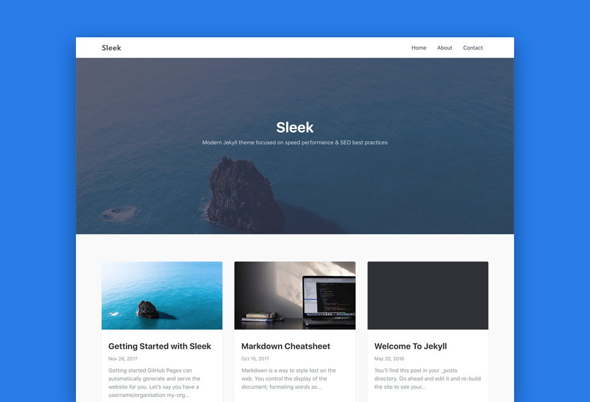

# Sleek

[](https://badge.fury.io/rb/jekyll-sleek) [](https://travis-ci.org/janczizikow/sleek) [](https://github.com/janczizikow/sleek)

A modern [Jekyll](https://jekyllrb.com/) theme focused on speed performance & SEO best practices.

> ⚠️ This theme is no longer actively maintained.



## Features

* Compatible with [Github Pages](https://pages.github.com/)
* Minimal, responsive and speed performance optimized
* SEO friendly, with help of [Jekyll SEO Plugin](https://github.com/jekyll/jekyll-seo-tag)
* Easy [Google Tag Manager](https://tagmanager.google.com/) Integration
* Support for [Disqus](https://disqus.com/) comments
* Form submissions with [Formspree](#formspree)

[Preview Demo](https://janczizikow.github.io/sleek/)

## Installation

### System Requirements

To use this project, you'll need the following things on your local machine:

#### Jekyll

```shell
gem install jekyll
```

#### NodeJS (8 or greater)

Download and open the [NodeJS installer](https://nodejs.org/en/)

#### Gulp CLI (optional, but recommended)

```shell
npm install --global gulp-cli
```

### Up & Running

1. [Fork the repo](https://github.com/janczizikow/sleek/fork)
2. Clone or download the repo into directory of your choice: `git clone https://github.com/your-github-username/sleek.git`
3. Inside the directory run `bundle install` and `npm install`
4. If you want to use [gulp.js](https://gulpjs.com/) run `gulp` or `npm start`
    * if you don't want to use gulp you can run `bundle exec jekyll serve` instead

#### Installing to existing jekyll project

Add this line to your Jekyll site's `Gemfile`:

```ruby
gem "jekyll-sleek"
```

And add this line to your Jekyll site's `_config.yml`:

```yaml
theme: jekyll-sleek
```

And then execute:

    $ bundle

Or install it yourself as:

    $ gem install jekyll-sleek

## File Structure Overview

```bash
sleek
├── _includes	               # theme includes
├── _js	                       # javascript files (by default jquery will be included with the scripts inside)
├── _layouts                   # theme layouts (see below for details)
├── _pages                     # pages folder (empty by default)
├── _posts                     # blog posts
├── _sass                      # Sass partials
├── assets
|  ├── css	               # minified css files
|  ├── img                     # images and icons used for the template
|  └── js		               # bundled and minified files from _js folder
├── _config.yml                # sample configuration
├── gulpfile.js                # gulp tasks (tasks autorunner)
├── index.md                   # sample home page (blog page)
└── package.json               # gulp tasks
```

## Usage

You can modify the theme by changing the settings in `_config.yml`.

### Posts

Create a new Markdown file such as 2017-01-13-my-post.md in _post folder. Configure YAML Front Matter (stuff between `---`):

```yaml
---
layout: post # needs to be post
title: Getting Started with Sleek # title of your post
featured-img: sleek #optional - if you want you can include hero image
---
```

#### Images

In case you want to add a hero image to the post, apart from changing featured-img in YAML, you also need to add the image file to the project. To do so, just upload an image in .jpg format to `_img` folder. The name must before the .jpg file extension has to match with featured-img in YAML. Next, run `gulp img` from command line to generate optimized version of the image and all the thumbnails. You have to restart the jekyll server to see the changes.

Sleek uses [Lazy Sizes](https://github.com/aFarkas/lazysizes). Lazy Loader for loading images. Check the link for more info. Lazy Sizes doesnt’t require any configuration and it’s going to be included in your bundled js file.

### Pages

The home page is located under index.md file. To change the content or design you have to edit the default.html file in `_layouts` folder.

In order to add a new page, create a new html or markdown file under root directory or inside _pages folder. To add a link in navigation add it in `_config.yml`:

```yaml
# THEME SETTINGS
navigation: # Navigation links
  - {name: 'Home', link: '/'}
  - {name: 'About', link: '/about'}
  - {name: 'Contact', link: '/contact'}
```

`name` is the text that will be shown and link, well, it's a link.

### Site configuration

Sleek comes with [`jekyll-seo-tag`](https://github.com/jekyll/jekyll-seo-tag) plugin preinstalled to make sure your website gets the most useful meta tags. See [usage](https://github.com/jekyll/jekyll-seo-tag/blob/master/docs/usage.md) to know how to set it up.

Additionally, in `_config.yml` you can find custom theme settings under `# THEME SETTINGS` comment. Here's a brief overview of those custom settings:

- `navigation` - collection of links that will be shown in the header
- `tagline` - text that will be displayed on the homepage under the heading.
- `hero_img` - background image of the homepage hero section

Other settings usually enable/disable certain feature, and are discussed with the next sections.

### Google Tag Manager

To enable Google Tag Manager, add the uncomment the following line in `_config.yml`:

```yaml
google_tag_manager: GTM-XXXXXXX
```

Replace `GTM-XXXXXXX` with your Google Tag Manager Container ID.

**Note** by default GTM tracking snippet will be also included in development environment.

Google Tag Manager was chosen for this project as it's more flexible than Google Analytics, and it can be used to add GA to your site.

### Disqus

To enable Disqus comments, add your [Disqus shortname](https://help.disqus.com/customer/portal/articles/466208) to `_config.yml`:

```yaml
disqus:
  shortname: my_disqus_shortname
```

### Formspree

To use [Formspree](https://formspree.io/) with your email address, you need to change the following:

Change `your-email@domain.com` email in `_config.yml`

```yaml
email: your-email@domain.com
```

You can check if it works by simply submitting the form.

If you have a Formspree Gold Account, you can take advantage of using AJAX to submit form. To do so, uncomment last function in `_js/scripts.js` and run `gulp js`. Now the form will be submitted asynchronously, without leaving the page.

## Contributing

Bug reports and pull requests are welcome on GitHub at [https://github.com/janczizikow/sleek](https://github.com/janczizikow/sleek). This project is intended to be a safe, welcoming space for collaboration, and contributors are expected to adhere to the [Contributor Covenant](http://contributor-covenant.org) code of conduct.

## Development

To set up your environment to develop this theme, run `bundle install` and `npm install`.

The theme is setup just like a normal Jekyll site! Check out [file structure overview](#file-structure-overview) for details. To test the theme, run `gulp` and open your browser at `http://localhost:3000`. This starts a Jekyll server using the theme. Add pages, documents, data, etc. like normal to test the theme's contents. As you make modifications to the theme and to the content, your site will regenerate and you should see the changes in the browser after a refresh, just like normal.

## License

The theme is available as open source under the terms of the [MIT License](https://opensource.org/licenses/MIT).
